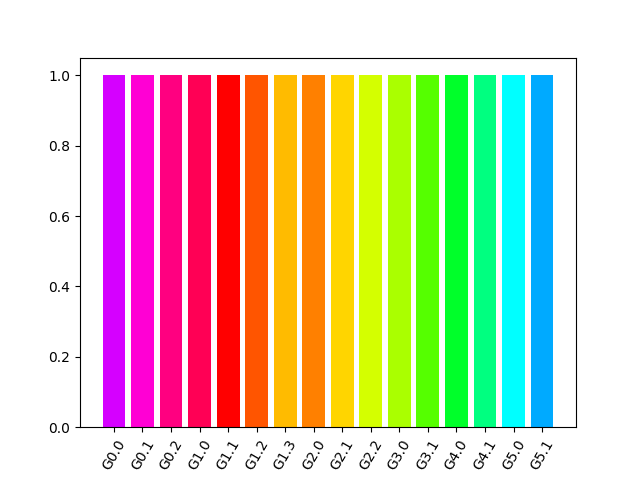
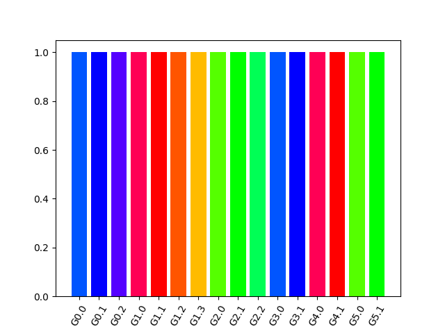

Cuttleyack
==========

(Naive) Hierarchical color scale implementation.

Adapted from `Waldin et al., 2019`_.

The weight on the index vs. the group is controlled by the angles :math:`alpha`
and :math:`beta`:

alpha: 120; beta: 50 (positional index has more weight)

alpha: 5; beta: 120 (group has more weight)

Not implemented
---------------

Rotational shift not implemented (zoom).

.. _Waldin et al., 2019: https://onlinelibrary.wiley.com/doi/epdf/10.1111/cgf.13611
